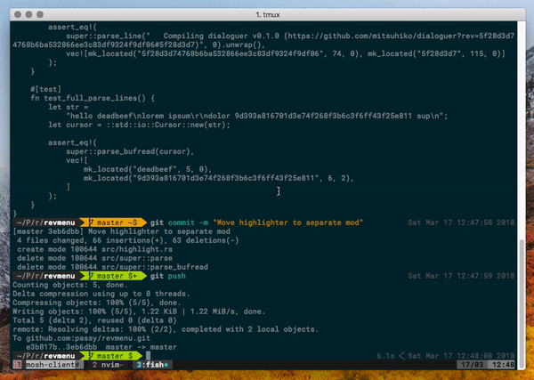

# tmux revmenu

Tmux wrapper around [revmenu](https://github.com/passy/revmenu).

Quickly checkout any revision on your terminal window.

## Demo



## Dependencies

- `revmenu`

Key bindings

## Key bindings

In any tmux mode:

- `v` - The "v" in revision. Select and checkout/update a revision.

## Installation with [Tmux Plugin Manager](https://github.com/tmux-plugins/tpm) (recommended)

Add plugin to the list of TPM plugins in .tmux.conf:

```tmux
set -g @plugin 'passy/tmux-revmenu'
```

Hit prefix + I to fetch the plugin and source it. You should now be able to use the plugin.

### Manual Installation

Clone the repo:

```bash
$ git clone https://github.com/passy/tmux-revmenu ~/clone/path
```

Add this line to the bottom of `.tmux.conf`:

    run-shell ~/clone/path/revmenu.tmux

Reload TMUX environment:

    # type this in terminal
    $ tmux source-file ~/.tmux.conf

You should now be able to use the plugin.

### Configuration

> How can I change the default "v" key binding to something else? For example,
> key "x"?

Put `set -g @revmenu-key 'v'` in `.tmux.conf`.

### Other goodies

`tmux-revmenu` works great with:

- [tmux-urlview](https://github.com/jbnicolai/tmux-urlview) - a plugin for
  quickly opening any url on your terminal window.
- [tmux-fpp](https://github.com/tmux-plugins/tmux-fpp) - a plugin for opening
  files in your `$EDITOR` of choice.

### License

[MIT](LICENSE)
